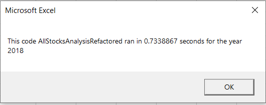

# Module 2

# 1.
The purpose of this project is to modify an existing VBA code for better efficiency if possible. About 3000 rows of stocks information for year 2017 and 2018 each are used for testing the VBA.

# 2.

Overall the stocks as in the market is better in 2017 than in 2018.  Most stocks yield a positive return, except stock TERP. On the other hand, most stocks in 2018 return negative, except stocks ENPH and  RUN.

Execution time for 2018 is faster 0.7338 seconds as oppose to 0.8508 seconds in 2017.

# 3. 
My refactoring yields better result. The original analysis' execution time as higher than 0.9 seconds. An obvious advantage is that it runs faster and more efficient.  However, it costs me much more time than saving 0.1 second.